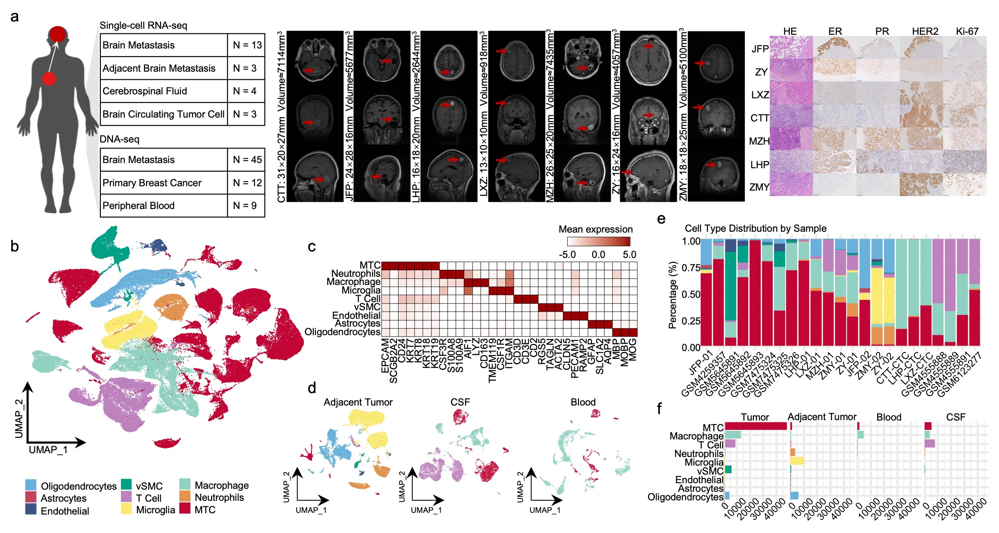

# **Dissecting genetic information, transcriptome regulation and TME of MTCs and CTCs by scRNA-seq in breast cancer brain metastasis**

Brain is the most common site of breast cancer metastasis, which is an increasing clinical problem and also is the leading reason for death in patients with metastatic breast cancer. Regrettably, our understanding of the biology of breast cancer brain metastasis (BCBM) is remains rudimentary. In this study, we performed a comprehensive multi-omics analysis including scRNA-seq in 23 patients and DNA-seq in 47 patients with BCBM. We interrogated the trajectory of BC cells from “primary - peripheral blood - circulating tumor cells (CTCs) -BM - cerebrospinal fluid (CSF)”. We explored the genetic features, the regulation of transcriptomics, and the tumor immune microenvironment (TIME) of BCBM. Our data suggested that the brain microenvironment induces BC cells to generate a new molecular subtype, Neuron related BC cells, which exhibits some molecules that are closely related to synaptogenesis and neurochemical secretion; we found that mutations in NRXN1, GABRB3, and SPHK1 are related to BM at both the tissue and single-cell levels. The mutations in GABRB3 and SPHK1 can be detected in BM associated CTCs, which is expected to help in real-time risk assessment and early diagnosis of BCBM. To date, we provide the largest and most comprehensive resource on BCBM, providing a solid foundation for understanding the mechanisms of BCBM development, early identification of high-risk patients, and drug development.

<b>single-cell and genome sequencing in tumors and CTCs resolved genetic seeds and soil atlas of human breast cancer brain metastasis
</b>

## Pre-requisites:

- Linux (Based on Ubuntu 20.04 LTS, Personal Computer) 
- CPU AMD Ryzen threadripper pro 3975wx 32-cores x 64
- NVIDIA GeForce RTX 3090 24GB 384bit 1695MHz 19500MHz 
- Memory 1.024 TiB (128GB * 8) DDR4 2666MHz
